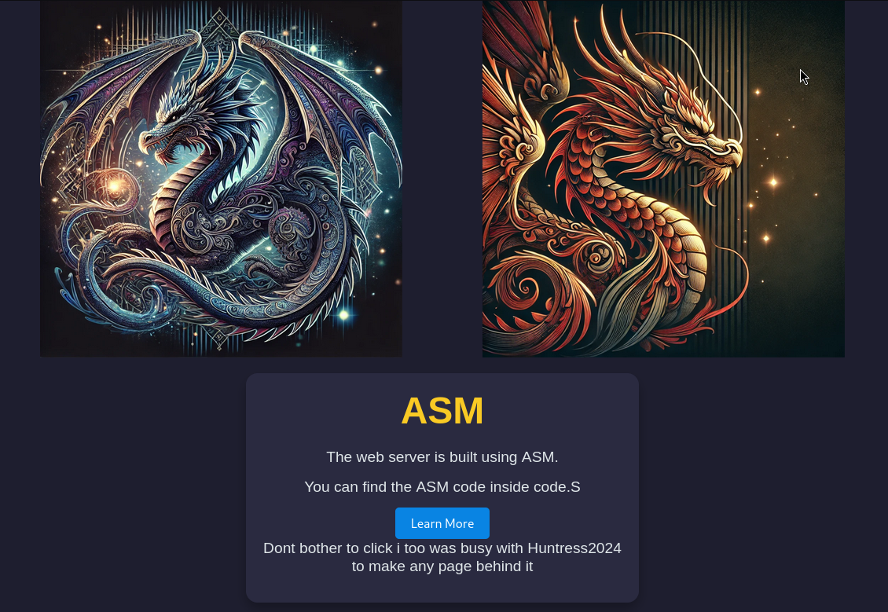

# 🌐 Assembly WebServer - Minimal HTTP Server

This repository implements a **basic web server in assembly** language, demonstrating low-level networking by handling basic HTTP requests on `localhost:80`.


## 🗂️ Contents

- **`index.html`**: Main HTML page served by the server.
- **`405.html`**: Custom 405 error page, displayed when users make unsupported requests (e.g., POST) or trying to access any website the program cannot read.
- **`code.S`**: Assembly source code implementing the web server.
- **`images/`**: Contains image assets like `dragon2_image.png`, which are currently loaded from the internet rather than locally.

## 🌟 Features

- **Simple GET Requests**: Only requested pages (e.g., `index.html`) are rendered. Non-existent files, like `nonexistant.html`, will not load.
- **Basic Error Handling**: Unsupported POST requests will redirect users to the **405 error page**.

## 🚀 Usage

1. **Compile** the assembly code:
   ```
   gcc -nostdlib -static code.S
   ```
   
2. **Run** the server:
   ```
   ./a.out
   ``

3. Access it on **`http://localhost:80`**.

## 💡 Code Highlights 
   - For the 405.html , under the `File_Open_Read_Write_Subroutine:` section you'll find an open() syscall
   ```
     open:   
 
    mov rsi, 0             # O_RDONLY
    mov rax, 2               # open()
    xor rdx,rdx
    syscall
    cmp rax,0xfffffffffffffffe
    je Not_Get
```

If the file cannot be opened (returning -1), the program jumps to the Not_Get label, displaying 405.html

  - For the sockaddr_in_client structure , Initially it was used to fetch the user IP , and using the write syscall for logging purpose to write it , Due to some error i've commented it out for now. and removed the dec_to_hex part

   - on GET_Request , `Get_Request` will be written on fd1

 - for the IP/PORT :
```sockaddr_in:  
    .word 2                # AF_INET (IPv4)
    .word 0x5000           # Port 80 in network byte order (0x5000)
    .long 0                # INADDR_ANY (bind to any address)
```
You can change the port by update .word 0x5000 to a different value (e.g. , .word 0x5c11 for port 4444)


## 📜 License

This project is open for modification and use—ideal for learning low-level web server mechanics! 🎉


## 🛠️📝 TODO
- Clean up comments.
- Improve code readability and structure.
- Re-enable logging of each request's origin IP.
- Add preliminary DDoS protection (the server currently processes requests without restrictions, leaving it open to abuse).
